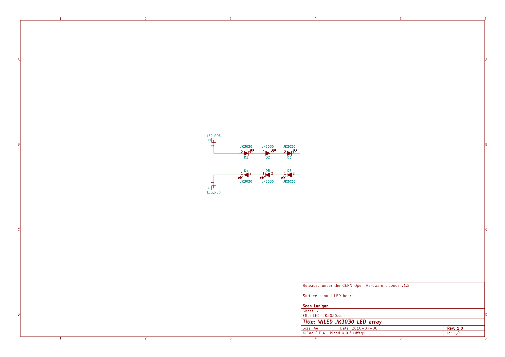

# WiLED: JK3030 LED board

Circuit board for up to six CREE JK3030 LEDs. To be used with a WiLED main board, which provides a 350 mA constant-current DC supply to the LEDs. The PCB is intended to be aluminium rather than FR4, and attached to a heatsink. 

# Licence

All hardware schematics and design files are released under the CERN Open Hardware Licence v1.2. Please see [LICENCE](LICENCE) for details.
